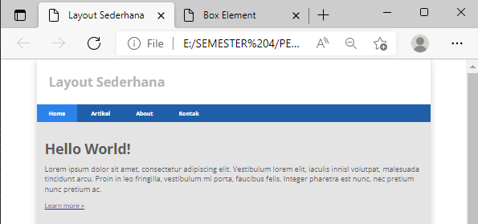
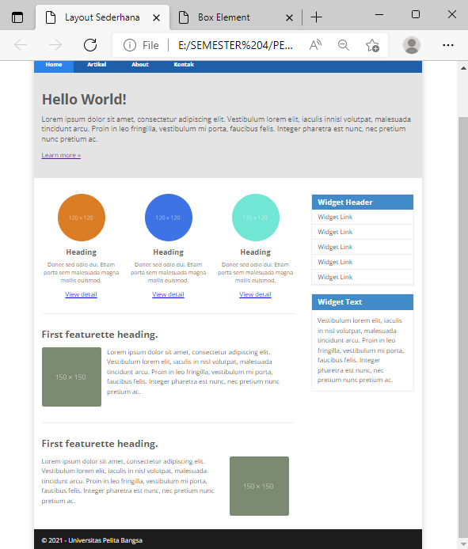

# Lab4Web
Tugas Pertemuan 5

Nama : Abdul Rahman

NIM : 312010061

Kelas : TI.20.B.1

Langkah praktikum 

1. membuat dokumen HTML kemudian membuat Box Element

2. membuat clearfix element

3. membuat navigasi

4. membuat hero panel

5. Membuat elemen lainnya dan content artikel 

